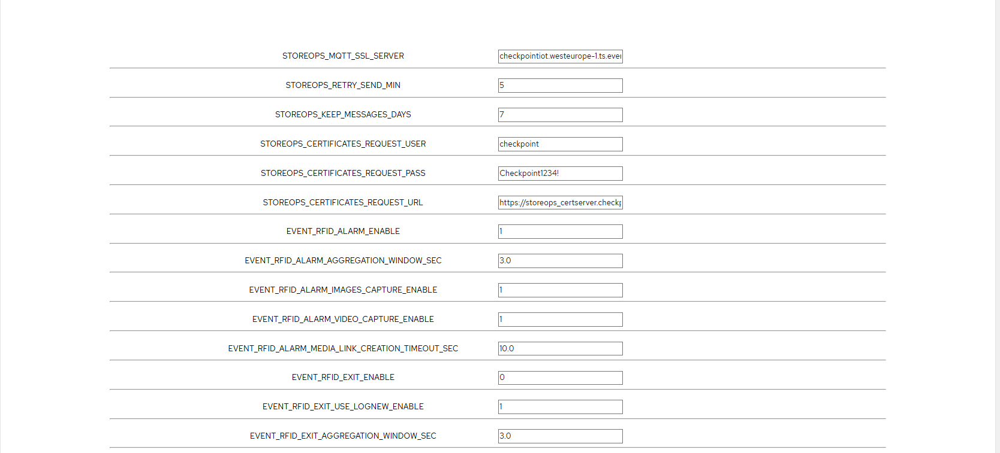
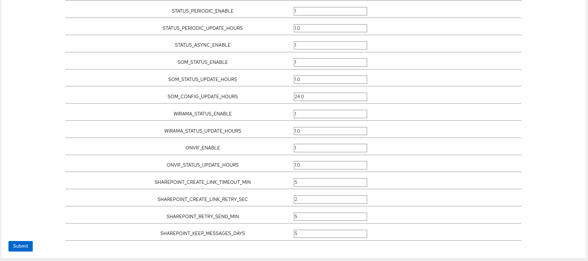

# storeops-custom-application
Storeops custom application

## configuration tab

- STOREOPS_MQTT_SSL_SERVER: URL of external broker. 

- STOREOPS_RETRY_SEND_MIN: Minutes to wait before intent to resend a failed message.

- STOREOPS_KEEP_MESSAGES_DAYS: Number of days to keep stored all message.

- STOREOPS_CERTIFICATES_REQUEST_USER:  User for SSL certificate creation API Service.

- STOREOPS_CERTIFICATES_REQUEST_PASS:  User for SSL certificate creation API Service.

- STOREOPS_CERTIFICATES_REQUEST_URL:  URL for SSL certificate creation API Service.

- EVENT_RFID_ALARM_ENABLE:   Enables (1) or disables (0). Send alarm events to storeops.

- EVENT_RFID_ALARM_AGGREGATION_WINDOW_SEC: Time to wait between alarms events to group epc's in a single list.

- EVENT_RFID_ALARM_IMAGES_CAPTURE_ENABLE: Enables (1) or disables (0). Capture snapshots.

- EVENT_RFID_ALARM_VIDEO_CAPTURE_ENABLE:  Enables (1) or disables (0). Capture videos.

- EVENT_RFID_ALARM_MEDIA_LINK_CREATION_TIMEOUT_SEC: Seconds to wait for Azure link creation request.

- EVENT_RFID_EXIT_ENABLE: Enables (1) or disables (0). Exit message.

- EVENT_RFID_EXIT_USE_LOGNEW_ENABLE:  Enables (1) or disables (0). Log New message .

- EVENT_RFID_EXIT_AGGREGATION_WINDOW_SEC:  Seconds to wait between exits events.

- STATUS_PERIODIC_ENABLE: Enables (1) or disables (0). Periodic status message.

- STATUS_PERIODIC_UPDATE_HOURS: Period of time in hours to update status.

- STATUS_ASYNC_ENABLE: Enables (1) or disables (0). Status asyncronous.

- SOM_STATUS_ENABLE: Enables (1) or disables (0). Send SOM status message.

- SOM_STATUS_UPDATE_HOURS: Period of time in hours to update status of SOM.

- SOM_CONFIG_UPDATE_HOURS: Period of time in hours to update status of SOM Config.

- WIRAMA_STATUS_ENABLE: Enables (1) or disables (0). Send Wirama status message.

- WIRAMA_STATUS_UPDATE_HOURS: Period of time in hours to update status of Wirama message.

- ONVIF_ENABLE: Enables (1) or disables (0). ONVIF Application for capturing images/videos.

- ONVIF_STATUS_UPDATE_HOURS: Period of time in hours to update status of Camera .

- SHAREPOINT_CREATE_LINK_TIMEOUT_MIN: Minutes to wait for Azure link creation timeout.

- SHAREPOINT_CREATE_LINK_RETRY_SEC: Seconds to wait for retry Azure link creation.

- SHAREPOINT_RETRY_SEND_MIN: Minutes to wait for upload files.

- SHAREPOINT_KEEP_MESSAGES_DAYS: Number of days to keep message in storage.